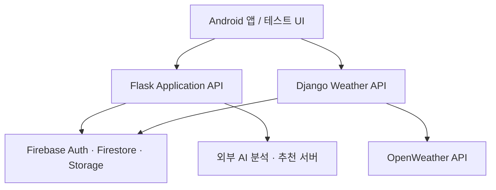

# WEARTHER Backend

[](https://github.com/gaemotae/404_found/actions/workflows/ci.yml?query=branch%3Aportfolio-backend-cleanup)

날씨와 사용자의 옷장 정보를 바탕으로 코디를 추천하고, 추천 이력과 커뮤니티 기능을 제공하는 졸업 팀 프로젝트의 **백엔드 담당 코드 정리본**입니다.

프로젝트명 `WEARTHER`는 옷을 뜻하는 `WEAR`와 날씨를 뜻하는 `WEATHER`를 결합한 이름입니다.

이 저장소에는 직접 담당한 백엔드 서비스만 포함합니다. Android 프론트엔드와 AI 모델 서버의 소스는 포함하지 않으며, 백엔드에서는 해당 서비스의 API를 연동합니다.

> 팀 전체 프로젝트 원본: [ggyyuubb/404_found](https://github.com/ggyyuubb/404_found)

## 담당 범위

- Flask 기반 애플리케이션 API와 JWT·Firebase 인증 흐름
- 회원·프로필·옷장·추천 이력·커뮤니티 데이터 처리
- 이미지 분석 및 코디 추천 AI 서버와의 API 연동
- Django 기반 날씨·대기질 수집 API와 Firestore 적재

Android 화면과 AI 모델 학습·추론 로직은 다른 팀원의 담당 영역이므로 이 저장소의 구현 범위에서 제외했습니다.

## 주요 기능

- Firebase Authentication 토큰 검증 및 JWT 기반 인증
- 회원가입, 로그인, 프로필 및 사용자 설정 관리
- 옷 이미지 업로드와 AI 분류 서버 연동
- 옷장 데이터 조회·수정·삭제
- 날씨와 옷장 정보를 활용한 코디 추천 서버 연동
- 추천 결과·사용자 피드백·과거 추천 이력 저장
- 게시글, 댓글, 답글, 좋아요, 팔로우, 차단 등 커뮤니티 기능
- OpenWeather API를 이용한 시간별·일별 날씨 및 대기질 수집
- 수집한 날씨 데이터를 날짜 단위로 Firestore에 저장

## 기술 스택

| 구분 | 기술 |
| --- | --- |
| Language | Python |
| Application API | Flask, Flask-JWT-Extended |
| Weather API | Django |
| Data / Auth | Firebase Authentication, Cloud Firestore, Firebase Storage |
| External API | OpenWeather API, AI 의류 분석·코디 추천 API |

## 구성

| 디렉터리 | 역할 |
| --- | --- |
| [`app-api`](./app-api) | 인증, 회원, 옷장, 추천 이력, 커뮤니티 및 AI 서버 연동 |
| [`weather-api`](./weather-api) | 날씨·대기질 조회와 Firestore 저장 |
| [`docs/API.md`](./docs/API.md) | 주요 API 목록 |
| [`docs/PROJECT_NOTES.md`](./docs/PROJECT_NOTES.md) | 저장소 범위와 정리 기준 |

## 서비스 구조



## 실행 방법

두 서비스는 독립적으로 실행됩니다. 실제 실행에는 Firebase 서비스 계정, OpenWeather API 키, AI 서버 주소가 필요합니다.
Python 3.11 이상을 기준으로 정리했습니다.

### 1. Application API

```bash
cd app-api
python -m venv .venv
source .venv/bin/activate  # Windows: .venv\Scripts\activate
pip install -r requirements.txt
cp .env.example .env
python run.py
```

기본 주소는 `http://localhost:8080`입니다.

### 2. Weather API

```bash
cd weather-api
python -m venv .venv
source .venv/bin/activate  # Windows: .venv\Scripts\activate
pip install -r requirements.txt
cp .env.example .env
python manage.py runserver
```

기본 주소는 `http://localhost:8000`입니다.

## 환경변수

실제 키는 저장소에 올리지 않습니다. 각 서비스의 `.env.example`을 복사한 뒤 개인 환경에 맞게 값을 설정합니다.

- `AI_SERVER_URL`: 옷 이미지 분석 서버 주소
- `WEARTHER_AI_BASE_URL`: 코디 추천·설명 서버 주소
- [`app-api/.env.example`](./app-api/.env.example)
- [`weather-api/.env.example`](./weather-api/.env.example)

## 참고

- 이 저장소는 채용 담당자가 구현 범위를 쉽게 확인할 수 있도록 기존 개발 산출물에서 가상환경, 캐시, 로컬 DB, 샘플 업로드 파일, 인증 키 및 사용하지 않는 실험 코드를 제외한 버전입니다.
- AI 모델 자체는 팀 내 별도 담당 영역이며, 이 저장소에는 요청 데이터 구성, 응답 정규화, 재시도·타임아웃 처리, 추천 결과 저장 등 **백엔드 연동 로직**이 포함됩니다.
- 외부 서버와 기존 Firebase 프로젝트가 중단된 경우 코드는 확인할 수 있지만 전체 기능의 실시간 재현은 제한될 수 있습니다.

## 검증

GitHub Actions에서 다음 항목을 자동으로 확인합니다.

- Ruff 정적 검사 및 포맷 검사
- 전체 Python 소스 컴파일
- Flask 애플리케이션 import 및 `/ping` smoke test
- Django system check 및 단위 테스트
